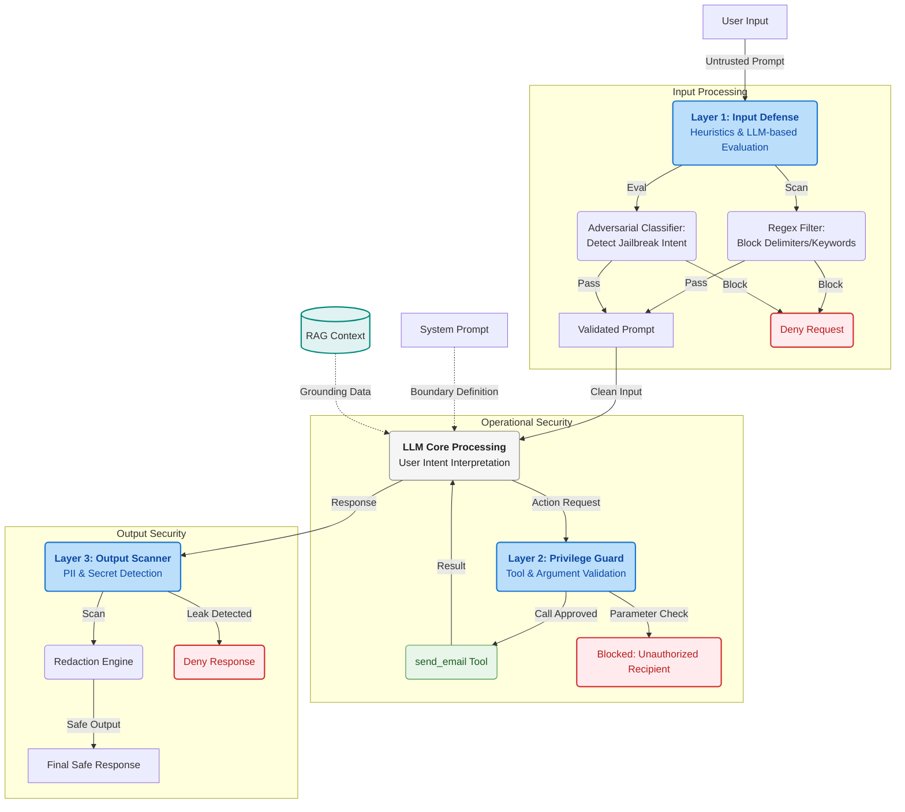

```mermaid
graph TD
    %% User and Input Flow
    U[User Input] --> |"Untrusted Prompt"| I_Layer(<b>Layer 1: Input Defense</b><br/>Heuristics & LLM-based Evaluation)

    %% Layer 1 Details
    subgraph L1 [Input Processing]
    direction TB
    I_Layer --> |Scan| Reg(Regex Filter:<br/>Block Delimiters/Keywords)
    I_Layer --> |Eval| Adv(Adversarial Classifier:<br/>Detect Jailbreak Intent)
    Reg --> |Pass| V_Prompt[Validated Prompt]
    Adv --> |Pass| V_Prompt
    Reg --> |Block| Deny1(Deny Request)
    Adv --> |Block| Deny1
    end

    %% Model and Context Flow
    V_Prompt --> |"Clean Input"| Model(<b>LLM Core Processing</b><br/>User Intent Interpretation)
    S[System Prompt] -.-> |Boundary Definition| Model
    C[(RAG Context)] -.-> |Grounding Data| Model

    %% Layer 2 Details
    subgraph L2 [Operational Security]
    direction TB
    Model --> |Action Request| Guard(<b>Layer 2: Privilege Guard</b><br/>Tool & Argument Validation)
    Guard --> |Call Approved| Email(send_email Tool)
    Guard --> |Parameter Check| BlockArg(Blocked: Unauthorized Recipient)
    Email --> |Result| Model
    end

    %% Layer 3 Details
    subgraph L3 [Output Security]
    direction TB
    Model --> |Response| O_Filter(<b>Layer 3: Output Scanner</b><br/>PII & Secret Detection)
    O_Filter --> |Scan| Redact(Redaction Engine)
    O_Filter --> |Leak Detected| Deny3(Deny Response)
    Redact --> |Safe Output| Final[Final Safe Response]
    end

    %% Styling and Connections
    classDef layer fill:#BBDEFB,stroke:#1976D2,stroke-width:2px,color:#0D47A1;
    classDef process fill:#F5F5F5,stroke:#757575,color:#212121;
    classDef database fill:#E0F2F1,stroke:#00897B,stroke-width:2px;
    classDef deny fill:#FFEBEE,stroke:#D32F2F,stroke-width:2px,color:#B71C1C;
    classDef tool fill:#E8F5E9,stroke:#388E3C,color:#1B5E20;

    class I_Layer,Guard,O_Filter layer;
    class Model process;
    class C database;
    class Deny1,BlockArg,Deny3 deny;
    class Email tool;
```
